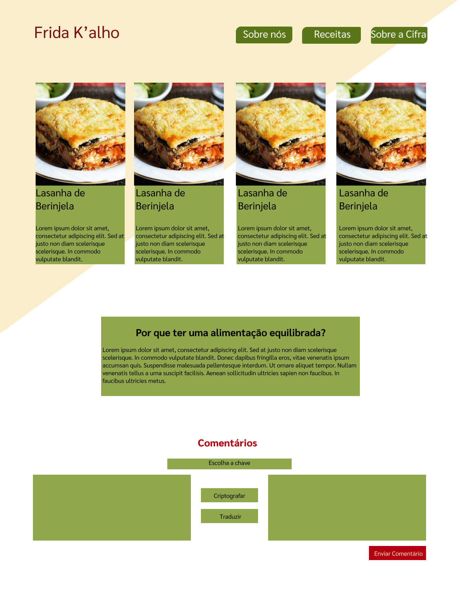
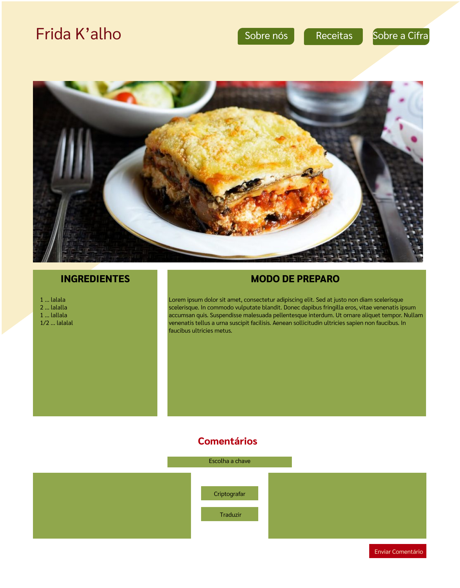

# Cifra de César

## Índice

* [1. Prefácio](#1-prefácio)
* [2. Resumo do projeto](#2-resumo-do-projeto)
* [3. Objetivos de aprendizagem](#3-objetivos-de-aprendizagem)
* [4. Considerações gerais](#4-considerações-gerais)
* [5. Critérios de aceitação mínimos do
  projeto](#5-critérios-de-aceitação-mínimos-do-projeto)
* [6. Hacker edition](#6-hacker-edition)
* [7. Considerações técnicas](#7-considerações-técnicas)
* [8. Guias, dicas e leituras
  complementares](#8-guias-dicas-e-leituras-complementares)
* [9. Checklist](#9-checklist)

***

## 1. Prefácio

Cifrar significa codificar. A [cifra de
César](https://pt.wikipedia.org/wiki/Cifra_de_C%C3%A9sar) é um dos primeiros
tipos de criptografias conhecidas na história. O imperador romano Júlio César
utilizava essa cifra para enviar ordens secretas aos seus generais no campo de
batalha.

A cifra de César é uma das técnicas mais simples de cifrar uma mensagem. É um
tipo de cifra por substituição, em que cada letra do texto original é
substituida por outra que se encontra há um número fixo de posições
(deslocamento) mais a frente do mesmo alfabeto.

Por exemplo se usarmos o deslocamento (_offset_) de 3 posições:

* Alfabeto sem cifrar: A B C D E F G H I J K L M N O P Q R S T U V W X Y Z
* Alfabeto com cifra:  D E F G H I J K L M N O P Q R S T U V W X Y Z A B C
* A letra A será D
* A palavra CASA será FDVD

Atualmente todas as cifras de substituição alfabética simples, são decifradas
com facilidade e não oferecem muita segurança na comunicação, mas a cifra de César
muitas vezes pode fazer parte de um sistema mais complexo de criptografia, como
a cifra de Vigenère, e tem aplicação no sistema ROT13.

## 2. Resumo do projeto

### FRIDA K'ALHO
O projeto consiste em uma página de receitas culinárias reais, onde uma mulher poderá cifrar uma mensagem de denúncio de abusos e/ou violência doméstica através dos comentários e enviá-la para a central de monitoramento 24h do site, que acionará a  polícia local.

#### Quem são os principais usuários do produto?
Mulheres em situação de violência, que precisam discretamente solicitar socorro;

#### Quais são os objetivos do usuário em relação com o produto?
Denunciar uma situação de abuso com segurança, através de uma plataforma de denuncia disfarçada de página de receitas culinárias;

#### Como você acredita que o produto está resolvendo os problemas do usuário?
Possibilidade de acionar socorro encriptando uma mensagem com endereço completo, situação que está acontecendo, grau de emergência. A mensagem criptografada é enviada pra central de monitoramento 24h, que aciona a polícia ou delegacia da mulher local. Com interface discreta (página de receitas culinárias);

#### Como foi o processo e decisões do design?
O projeto foi pensado pra que a mulher possa denunciar com segurança uma situação de violência, através de uma plataforma discreta, ela poderá efetuar sua denúncia como se estivesse deixando um comentário sobre uma receita culinária.

#### Interface do usuário (UI)

A interface permite ao usuário:

* Eleger um _offset_ indicando quantas posições de deslocamento de caracteres
  quer que a cifra utilize.
* Inserir uma mensagem (texto) para ser cifrada com letras maiusculas e minusculas.
* Ver o resultado da mensagem cifrada.
* Inserir uma mensagem (texto) para ser decifrada com letras maiusculas e minusculas.
* Ver o resultado da mensagem decifrada.

## 9. Checklist

Essa seção é para te ajudar a ter um controle do que você precisa completar.

